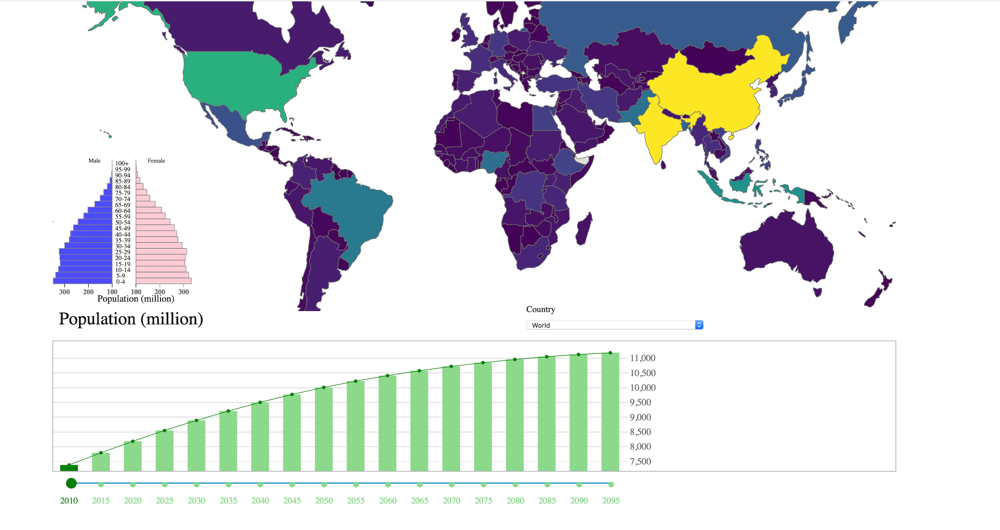
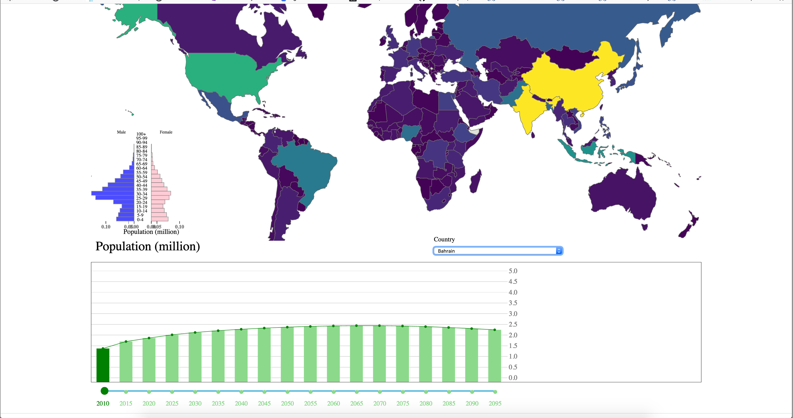
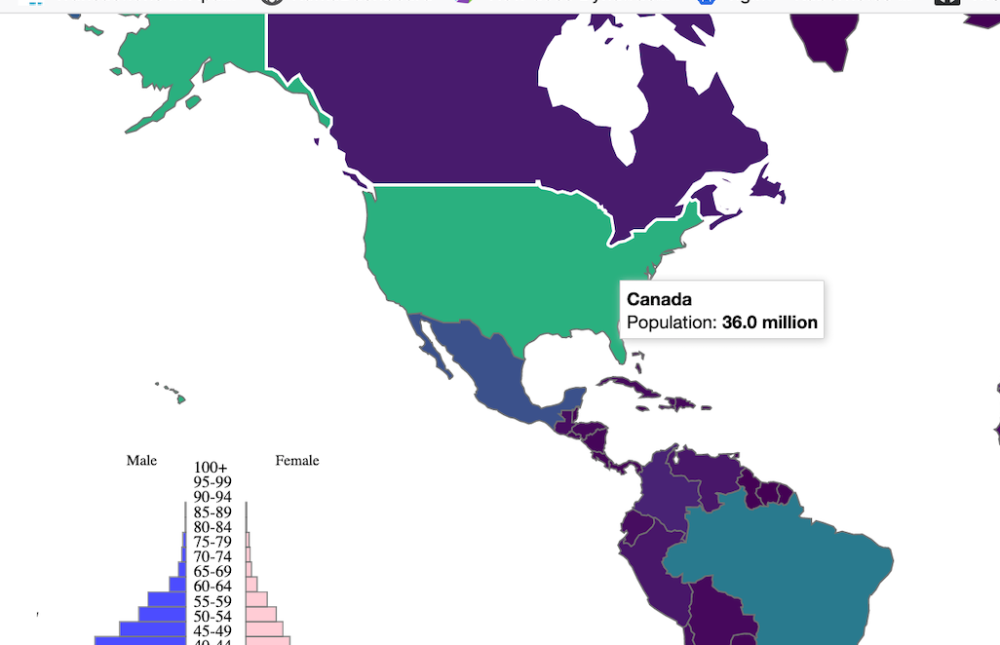
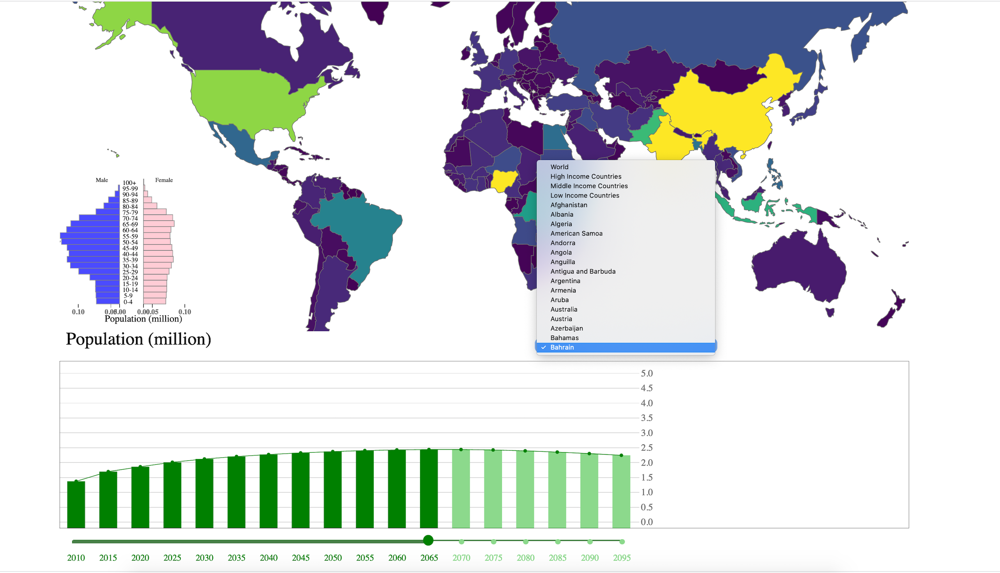

#Population Data

###Messaging. What is the message you are trying to communicate with the narrative visualization?

Population is trending upwards and this narrative explains how the world population is trending and would go in future (2010 to 2095).  The
measure showing the number of dependents, aged 0 to 14 and over the age of 65, to the total population aged 15 to 64. This indicator gives insight
into the amount of people of nonworking age compared to the number of those of working age.

###NARRATIVE STRUCTURE:

The narrative structure in this visualization aims towards Drill-down. On Landing page, user is presented with rich information about population
distributed across the world through the map, bar chart and pyramid chart. User can drill down by choosing options from drop-down menu that will
change the scene and parameters.

###SCENES:

In the initial scene, Landing page displays the population for year 2010 through map, pyramid graph and the bar graph. Tool tip on the map shows
population by country, pyramid graph shows male and female population distribution by age and bar graph where x-axis represents the year and y-axis
represents the population number in millions.

User can change the scene by choosing different years on the bar graph that will display the population trend for the chosen year.

User can drill down to choose a specific country from drop-down menu or clicking on map, that scene will display correlated information based on
selection.

###ANNOTATIONS:

Tooltip is used to annotate the information and display on mouse-over action. This is available on map and bar chart.

###PARAMETERS:

X-axis and Y-axis on the pyramid chart and bar graph, SVG dimensions and ranges, color modulation, circle on line graph on bar chart. These parameters
change corresponding to the user selection.

###TRIGGERS:

The trigger is the click action on world map that will auto-select the country & display information for that. Further, the drop down is available to
choose different values which displays information by different categories like 'high income countries', 'low income countries' etc.

Select by country  - By clicking any country in the map or selecting in the country selector (right bottom of the map) , the age pyramid and the bar
chart below will change according to your selection.

Select by Year - By drag the bottom year bar or clicking the bars in the bar chart, you can select the year you want and the map will change according
to your selection.

